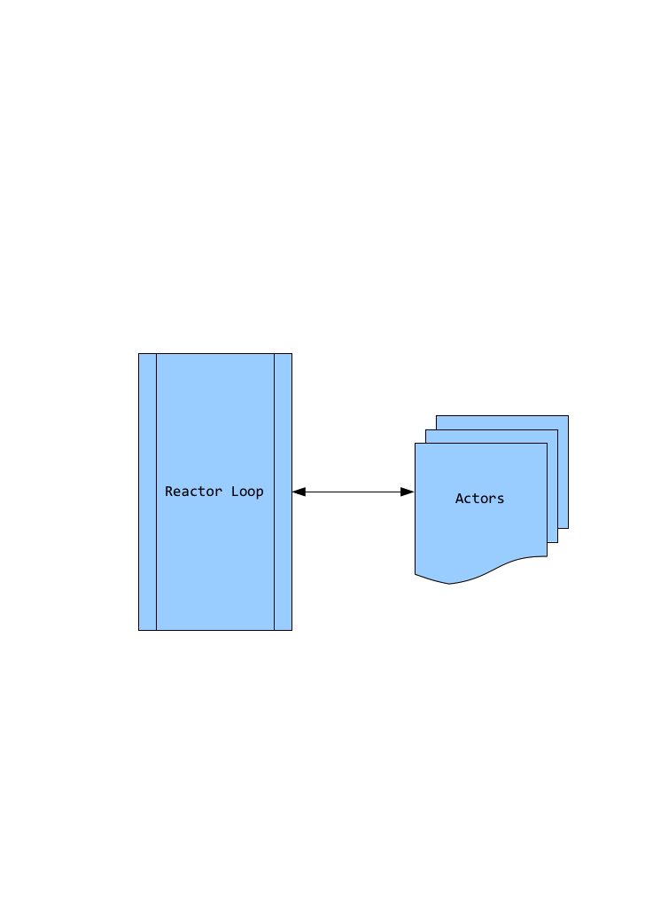

!SLIDE center

## All your Actors are belong to us ##

!SLIDE smbullets incremental

## I just hoped it is not that one  ##

* They exist in la-la land of Scala,Erlang (and other "functional" language).
* Can be event based or thread based (or can be decided by runtime).
* They talk by sending messages to each other.
* They have a Inbox and outbox.

!SLIDE center

### It reduces your flexibility in modeling - this is a world in which everyone sits in a windowless room and communicates only by mail. Programs are decomposed as piles of blocking switch statements. You can only handle messages you anticipated receiving. Coordinating activities involving multiple actors is very difficult. You can't observe anything without its cooperation/coordination - making ad-hoc reporting or analysis impossible, instead forcing every actor to participate in each protocol. ###

Rich Hickey on why Clojure doesn't implement Erlang-style Actor based model.

!SLIDE smaller

    @@@ ruby
    actor(:bar) do
      react do |message,sender|
        deliver(:foo,"Hello Foo howdy?)
        if(sender && sender.name == :foo)
          puts "Foo is saying: #{message}"
          deliver(:foo,"Goodbye Foo time to sleep)
          break
        end
      end
    end
    
    actor(:foo) do
      react do |message,sender|
        case message
        when String
          puts "Received a string : #{message} from actor #{sender.name}"
          deliver(sender,"Hey Bar, howdy?)
          break
        when Array
          puts "Received an Array: #{message} from actor #{sender.name}"
        end
      end
    end

!SLIDE smbullets incremental

## What was that? ##

* Homebrew 67 line Actor implementation for JRuby.
* Code is on : http://gist.github.com/338166
* Each Actor is running on its own thread.
* `actor(:foo)` returns an instance of Actor class, you can store it!
* The switch case, really looked ugly?

!SLIDE smbullets incremental

## Where can it be useful? ##

* For taking out blocking calls from your reactor loop!
* For doing lazy analysis or computation.
* For handling distributed stuff.

!SLIDE center

!SLIDE smaller

## Pattern matching makes actors based programming easier ##

    @@@ scala
    def process(item: AnyRef) = item match { 
      case KeyExpiry(key: String,ttl: Long) => { 
        val now = System.currentTimeMillis
        val timeout = now + ttl
        keyTimes(key) = timeout
        expiryTree.put(timeout,key)
      }
      case KeyDeleted(key: String) => { 
        keyTimes.removeKey(key).foreach(ttl => expiryTree.remove(ttl,key))
      }
    }

!SLIDE smaller

    @@@ ruby
    # revactor_example.rb
    myactor = Actor.spawn do
      Actor.receive do |filter|
        filter.when(:dog) { puts "I got a dog!" }
      end  
    end
    
!SLIDE

# Bad news - Abandoned #

!SLIDE bullets

## Good news - its not so hard anyways ##

* Implementing Thread based Actors
* link
* unlink

