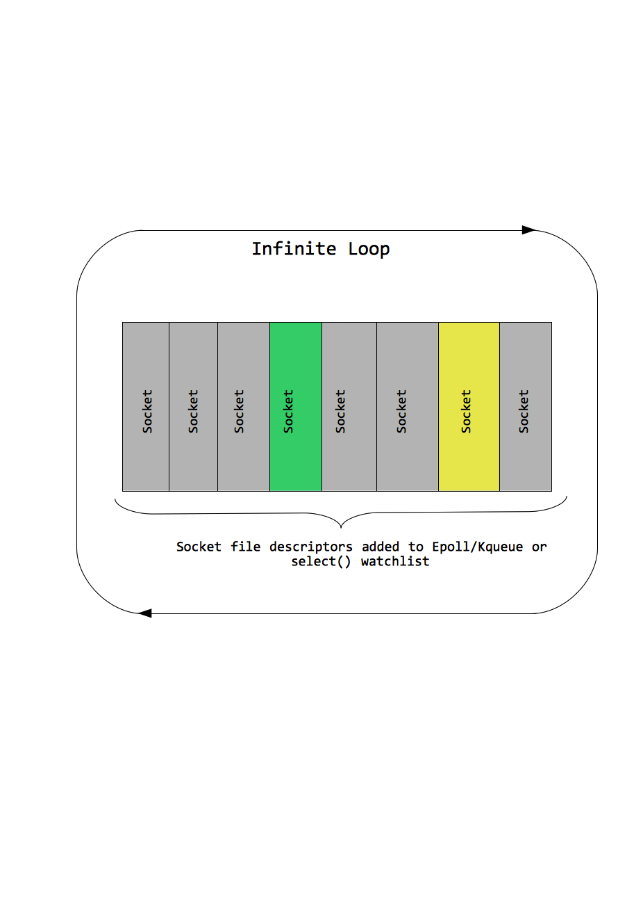

!SLIDE center

## Event Driven Network Programming ##

!SLIDE smbullets
## Attendees ##

* Eventmachine (http://rubyeventmachine.com)
* Packet (http://github.com/gnufied/packet)
* Revactor (http://revactor.org/)

!SLIDE left smaller

## Obligatory Echo Server/Client ##

    @@@ ruby
    # Echo Server
    module EchoServer
      def receive_data p_data
        @tokenizer.extract(p_data).each {|t_data| send_data(t_data + "\n") }
      end
      def post_init
        @tokenizer = BufferedTokenizer.new
      end
    end
    EventMachine.run do
      EventMachine.start_server("localhost",9000,EchoServer)
    end
    

!SLIDE left smaller

## Obligation continued ##

    @@@ ruby
    # Echo Client
    module EchoClient
      def receive_data(data)
        @tokenizer.extract(data) do |parsed_message|
          puts parsed_message
          close_connection()
        end
      end
      def connection_completed
        @tokenizer = BufferedTokenizer.new
        send_data("Hello World\n")
      end
    end
    EM.run do
      EM.connect("localhost",9000,EchoClient)
    end

!SLIDE left smbullets incremental

## What was that again? ##

* We use non-blocking IO.
* Unless you are doing a lot of computation in your program, your program is prolly IO bound.
* Instead of waiting on sockets to receive data (or write which is less obvious), we do something else during that.
* Single thread handles thousands of connections.
* You receive data as and when it is available.
* One instance of Class/Module passed per connection.

!SLIDE

## For driving the point home ##

!SLIDE smaller

## The Pure Ruby implementation ##

    @@@ ruby
    # method starts event loop in the process
    def start_reactor
       Signal.trap("TERM") { terminate_me }
       Signal.trap("INT") { shutdown }
       loop do
         check_for_timer_events
         @on_next_tick.call if @on_next_tick
         ready_read_fds,ready_write_fds,read_error_fds = 
	   select(read_ios,write_ios,[],0.005)
         if ready_read_fds && !ready_read_fds.empty?
           handle_read_event(ready_read_fds)
         elsif ready_write_fds && !ready_write_fds.empty?
           handle_write_event(ready_write_fds)
         end
       end
      end

!SLIDE smaller

## The C implementation ##
    
    @@@ c
    while (true) {
      _UpdateTime();
      if (!_RunTimers())
        break;

	_AddNewDescriptors();
	_ModifyDescriptors();

	if (!_RunOnce())
	  break;
	if (gTerminateSignalReceived)
	  break;
     }

!SLIDE smaller

## The Scala implementation ##

    @@@ scala
    def startReactor() = while(true) { 
      try {
        selector.select(5)
        checkForEvents()
        checkForActorMessages()
        checkForTimers()
      } catch { 
        case ex: IOException => errorHandler.get.apply(ex)
      }
    }

!SLIDE smbullets incremental

## The Usage pattern of Event based servers ##

* **Can be used write **
- Web Servers (http://code.macournoyer.com/thin/)
- Custom protocol Servers (Your ticker plant)
- Message Queues clients (http://github.com/tmm1/amqp)
- Pretty much anything that needs socket IO and is IO heavy.
* ** Not so useful for **
- Protocols which can't be demultiplexed easily.
- If you make blocking IO calls within application.
- If your application is too much IO heavy.

!SLIDE smbullets incremental

## Best Practices ##

* No `sleep` within your Reactor loop.
* No long running `SQL` queries or blocking Web Service calls within Reactor loop.
* **Try integrating everything within Event loop**
- MemCache (use nonblocking version)
- Redis (ditto)
- Evented Mysql(ditto)

!SLIDE smaller

## Don't do this ##

    @@@ ruby
    # Bad
    def unbind
      reconnect("localhost",9000,self)
    end
    
    # Good
    def unbind
      EM.add_timer(2) { reconnect("localhost",9000,self) }
    end

!SLIDE smaller

## Evented Code is harder ..##

    @@@ ruby
    # Blocking IO
    data = socket.readline()
    order_object = OrderParser.parse(data)
    another_socket.write(order_object.ticker_name.to_s)
    # Non Blocking IO
    def receive_data(raw_data)
      @tokenizer.extract(raw_data).each do |parsed|
        order_object = OrderParser.parse(parsed)
     	@clients[order_object.client_id].send_data(order_object.ticker_name.to_s)
      end
    end

Inversion of Control

continued...
	
!SLIDE smbullets incremental

## The hardship ensues ##

* Writing unit tests are harder
* The key is to test the areas that you are most worried about going wrong(MF Refactoring).
* Must have tests for parser (since they can be hard to get right)
* Mock or Stub the IO parts.
* Avoid too many instance variables for implicit state. Pass values to methods if you can.

!SLIDE smbullets incremental

## A tour of EM feature set ##

* EM.connect
* `EM.start_server("localhost",9000,Foo)`
* `EM.stop`
* `EM.next_tick`
* `EM.defer`
* `EM.popen`
* `EM::Timer`
* `EM::PeriodicTimer`
* `EM::Deferable`
* `EM.system`

EM feature set continued....

!SLIDE smbullets incremental

## EM feature set continued ##

* `EM.watch_file`
* `EM.watch`
* `EM::Protocols`

!SLIDE smbullets incremental

## Tour of Packet feature set ##

* Same API as Eventmachine but pure Ruby.
* Was written before Eventmachine had pure Ruby Reactor and certain other features.
* Reactors are object. Many reactor objects can exist within same process (potentially in different threads)
* Lets you create workers forked off from master process.

!SLIDE smaller

    @@@ ruby
    # Child Worker
    class FooWorker < Packet::Worker
      set_worker_name :foo_worker #=> This is necessary.
      def receive_data p_data
      end
    end
    # From master Process
    class MasterProcessWorker
      def connection_completed
        ask_worker(:foo_worker,:data => "new guy", :type => :request)
      end
      def worker_receive(data)
        puts "Received from worker #{data}"
      end
    end
    

